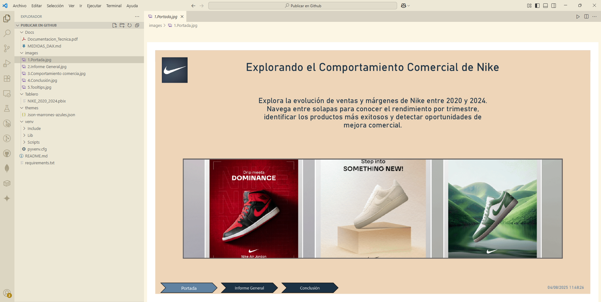

# Dashboard Power BI – Nike (2020–2024)

Este repositorio contiene el análisis comercial de Nike en EE. UU. entre 2020 y 2024, desarrollado en Power BI. Incluye visualizaciones dinámicas, segmentaciones por trimestre, márgenes, campañas y productos destacados.

## 📁 Estructura

| Archivo | Descripción |
|---------|-------------|
| Tablero/NIKE_2020_2024.pbix | Dashboard interactivo |
| Docs/Documentacion_Tecnica.pdf | Detalle técnico del modelo |
| Docs/MEDIDAS_DAX.md | Medidas DAX utilizadas |
| images/ | Capturas del modelo y reportes |

## 💾 Modelo de Datos

Estructura en estrella con la tabla de hechos `Ventas` y múltiples dimensiones relacionadas.

## 📐 Medidas DAX

Incluye:
- Facturación Total, Rentabilidad y Margen
- Tasa YoY, Mediana, Cuartiles
- Tooltips con narrativa dinámica

Más detalles en: [Medidas DAX utilizadas](Docs/MEDIDAS_DAX.md)

## ✅ Conclusión

El tablero permite identificar oportunidades de mejora comercial y analizar la evolución del rendimiento por año, trimestre y categoría.

## 📄 Documentación Técnica

- [Documentacion Tecnica del Dashboard Nike (2020–2024)](Docs/Documentacion_Tecnica.pdf)
- [Medidas DAX utilizadas](Docs/MEDIDAS_DAX.md)

## 🎨 Tema personalizado

El diseño visual del dashboard está basado en un archivo `.json` personalizado con colores azules y marrones. Puedes descargarlo y aplicarlo desde Power BI:

📁 [Descargar tema de color (.json)](themes/Json-marrones-azules.json)

